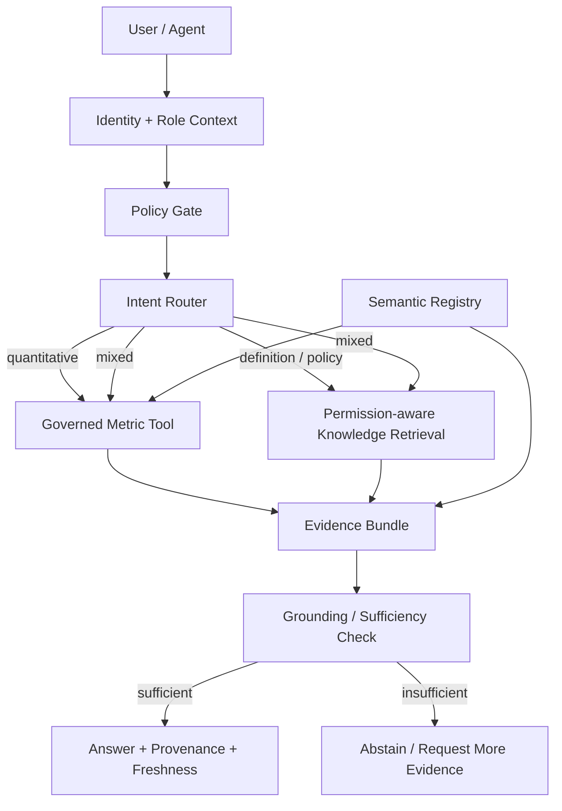

# CareOps Trust Gateway

> **A reference architecture for giving AI agents access to enterprise healthcare operations data without making the LLM the system of record.**

Enterprise agents often need two very different kinds of truth:

1. **authoritative structured facts** — counts, rates, identities, eligibility, availability; and
2. **unstructured context** — policies, definitions, SOPs, operational guidance.

A naive RAG architecture tends to flatten both into model context. In a regulated enterprise environment, that creates avoidable failure modes: unauthorized retrieval, stale definitions, model-invented metrics, weak provenance, and confident answers when evidence is missing.

**This project explores a different boundary:**

> **Models may reason about enterprise truth. Governed data systems remain authoritative for defining it.**

The implementation is intentionally small and dependency-light. It uses synthetic healthcare-operations data only and does **not** require an LLM API key. The point is to make the control plane — authorization, routing, semantic definitions, deterministic metrics, provenance, and failure behavior — inspectable.

---

## 30-second walkthrough

Ask:

> **Why did in-network appointment availability in Texas decline last week?**

The gateway does **not** hand a pile of documents and rows to an LLM and hope for the best.



For the demo data, the system finds that Texas bookable Aetna slots fell from **42** in the prior week to **24** last week. The structured-data tool attributes the decline to two governed facts:

- one provider became inactive during the week; and
- another provider's payer-network status moved out of `eligible`.

The policy retriever then supplies the **current** definition of network eligibility, while filtering out an obsolete policy version and any documents the caller is not authorized to retrieve.

The model-facing layer receives an **evidence bundle**, not unrestricted database access.

---

## Why this is not "just RAG"

| Question type | Example | Authority |
|---|---|---|
| Quantitative | "How many bookable Aetna slots were available in Texas last week?" | Deterministic SQL metric tool |
| Semantic | "What does `available_appointments` mean?" | Versioned semantic registry |
| Policy | "What counts as network eligible?" | Permission-aware retrieval |
| Mixed | "Why did availability decline?" | Structured metric evidence + policy context |

A language model can synthesize the evidence, but it is not allowed to silently become the calculation engine or policy authority.

---

## One request, step by step

### 1. Establish caller context

```text
role = analyst
question = "Why did in-network appointment availability in Texas decline last week?"
```

The caller's role is available **before retrieval**.

### 2. Route by intent

The request is classified as `mixed` because it asks for both:

- a quantitative change; and
- explanatory business context.

### 3. Resolve the metric through the semantic registry

`semantic/metrics.json` declares the definition, grain, owner, freshness expectation, and authoritative tool for `available_appointments`.

```json
{
  "metric": "available_appointments",
  "definition": "Bookable appointment slots for active providers currently eligible for the requested payer network.",
  "authority": "tool:get_metric",
  "grain": ["provider_id", "slot_date", "payer_network", "state"]
}
```

The model does not invent the calculation.

### 4. Calculate the metric deterministically

The metric tool queries the synthetic operational dataset using explicit provider-active and payer-eligibility rules.

Expected demo result:

```text
prior week: 42 slots
last week:  24 slots
change:    -18 slots (-42.9%)
```

### 5. Retrieve only authorized, current policy context

The retriever applies:

- role-based visibility **before** returning content;
- effective-date filtering;
- authority/version preference; and
- source provenance.

That means an obsolete 2025 network policy is not mixed with the 2026 policy, and an `analyst` cannot retrieve a restricted credentialing-escalation document.

### 6. Assemble evidence, then answer

The gateway produces an evidence bundle containing:

- metric values;
- contributor breakdown;
- metric definition;
- policy evidence;
- source identifiers;
- as-of date / freshness.

If the required evidence is missing, the gateway returns an **insufficient evidence** result rather than manufacturing a plausible answer.

---

## The deliberately unsafe comparison (v0.1 lexical baseline)

`examples/naive_rag.py` is a frozen lexical baseline. It has no authorization or effective-date concept, so a query can surface both a stale policy and a restricted policy. The governed v0.1 path moves those decisions **before** model context is assembled.

## Fair RAG comparison (v0.2)

v0.2 adds a shared retrieval substrate so the naive vs governed contrast is an apples-to-apples experiment:

```text
SAME corpus · SAME chunking · SAME embedder

Naive     → top-k hybrid similarity over unfiltered chunks → (optional) GPT
Governed  → role + effective-date filter BEFORE retrieval
          → hybrid retrieve + RRF
          → governed metric tool for quantitative facts
          → (optional) GPT via OpenAI Responses API + tool calls
```

Offline (no API key; deterministic local embedder):

```bash
pip install -e '.[dev]'
python examples/compare_rag.py
python -m careops.agent.cli --mode governed --role analyst --no-synthesize \
  "Why did in-network appointment availability in Texas decline last week?"
```

With a server-side key (never commit secrets; see `.env.example`):

```bash
pip install -e '.[rag]'
export OPENAI_API_KEY=...
export CAREOPS_EMBEDDING_PROVIDER=openai
python -m careops.agent.cli --mode naive --synthesize \
  "network eligibility credentialing escalation"
python -m careops.agent.cli --mode governed --role analyst --synthesize \
  "Why did in-network appointment availability in Texas decline last week?"
```

The dependency-light v0.1 control plane remains the default review path and does **not** require an API key.

---

## Evaluation cases

The project includes executable checks for the boundaries that matter more than prompt cleverness.

### Authorization

- analyst cannot retrieve restricted credentialing guidance
- clinical administrator can retrieve it
- policy filtering happens before evidence is returned

### Authority

- numeric availability comes from deterministic SQL
- metric definition names its authority and grain
- the gateway does not emit an unsupported numeric answer

### Retrieval

- current policy beats obsolete policy
- stale document is excluded as of the query date
- every retrieved document retains provenance

### Routing / failure behavior

- numeric question routes to the metric tool
- policy question routes to retrieval
- mixed question invokes both paths
- unsupported question abstains instead of hallucinating

Run the unit suite and the boundary evaluation harness:

```bash
python -m pytest -q
python -m evals.run
```

No network calls or API keys are required.

---

## Quick start

```bash
git clone <this-repo>
cd careops-trust-gateway
python3 -m venv .venv
source .venv/bin/activate
pip install -e '.[dev]'
python -m careops.bootstrap
python -m careops.cli --role analyst \
  "Why did in-network appointment availability in Texas decline last week?"
python -m pytest -q
python -m evals.run
```

Try the unsafe comparison:

```bash
python examples/naive_rag.py "network eligibility credentialing escalation"
```

Try a restricted policy as different roles:

```bash
python -m careops.cli --role analyst "What is the credentialing escalation procedure?"
python -m careops.cli --role clinical_admin "What is the credentialing escalation procedure?"
```

---

## Optional MCP surface

`mcp_server/server.py` exposes the same governed capabilities as four narrow tools when the official MCP Python package is installed:

- `get_metric`
- `explain_metric`
- `search_policy`
- `resolve_entity`

The MCP adapter is intentionally thin. The trust boundary lives in the underlying domain services, not in the protocol layer.

```bash
pip install -e '.[mcp]'
python mcp_server/server.py
```

## Optional dbt path

The `dbt/` project expresses the same bookability rules as DuckDB Bronze → Silver → Gold models. It is optional and not required to exercise the control-plane demo.

```bash
pip install -e '.[dbt]'
cd dbt
cp profiles.example.yml profiles.yml
export DBT_PROFILES_DIR="$PWD"
dbt seed && dbt run && dbt test
```

---

## Data model

The synthetic source system contains:

- providers;
- payer-network participation; and
- appointment slots.

A small dbt project under `dbt/` shows how the same rules can be expressed as Bronze -> Silver -> Gold transformations (DuckDB profile example included). It is optional and separate from the dependency-light SQLite control-plane demo, which is what reviewers should run first.

```text
raw providers             raw network participation          raw slots
      \                              |                         /
       \                             |                        /
        +----------------------------+-----------------------+
                                     |
                                  Silver
                     canonical provider/network/slot rules
                                     |
                                    Gold
                         bookable provider availability
                                     |
                           governed metric tools
```

---

## Key design decisions

### 1. Authorization happens before retrieval

Filtering sensitive content after it has already entered model context is not an access-control strategy. The retriever receives caller role/context and filters sources before returning evidence.

### 2. Quantitative truth comes from governed tools

A model may decide **which** metric is relevant. It does not get to invent the metric definition or silently recompute enterprise KPIs from arbitrary context.

### 3. Semantic definitions are explicit and versionable

A metric name alone is not a contract. The registry includes definition, grain, owner, authority, freshness expectations, and supported dimensions.

### 4. Retrieval is time-aware

Policies carry effective dates. The current answer should not accidentally combine yesterday's and today's operating rules because both documents happen to be semantically similar.

### 5. Failure is a first-class output

If evidence is missing or the request is outside the governed surface, the correct response is to abstain or ask for additional evidence — not to optimize for always producing an answer.

---

## What I would change at production scale

This repository intentionally isolates the architecture decision from infrastructure complexity. In a production healthcare environment I would expect to replace or extend pieces such as:

| Demo | Production direction |
|---|---|
| SQLite | Warehouse / operational store appropriate to the domain |
| token-overlap retrieval | enterprise search / vector + lexical hybrid retrieval |
| local role string | workload/user identity from enterprise IAM |
| JSON semantic registry | governed semantic/catalog service with ownership and change workflow |
| local audit log | centralized immutable audit/observability pipeline |
| local effective-date logic | versioned policy/content lifecycle with approval workflow |
| deterministic templates | LLM synthesis constrained to evidence bundle + evals |
| single process | service boundaries, caching, retries, tracing, SLOs |

For real PHI, I would also expect explicit data classification, minimum-necessary access, tenant boundaries, audit retention, secrets management, data-loss controls, and security/compliance review around every model-facing path.

---

## Repository map

```text
careops-trust-gateway/
├── README.md
├── architecture/
│   ├── decisions.md
│   └── threat-model.md
├── careops/
│   ├── agent/          # v0.2 naive|governed pipelines + optional GPT
│   ├── rag/            # chunk, embed, filter, hybrid retrieve
│   ├── bootstrap.py
│   ├── cli.py          # v0.1 deterministic gateway CLI
│   ├── gateway.py
│   ├── metrics.py
│   ├── policy.py
│   └── ...
├── data/raw/
├── dbt/
├── evals/
├── examples/
│   ├── naive_rag.py    # v0.1 lexical unsafe baseline (frozen)
│   └── compare_rag.py  # v0.2 fair naive vs governed
├── knowledge/
├── mcp_server/
├── semantic/
└── tests/
```

---

## Design principle

> **Models can reason about enterprise truth; they should not silently become the authority that defines it.**

This is a reference implementation built with synthetic data for architecture discussion and evaluation — not a production clinical system.
